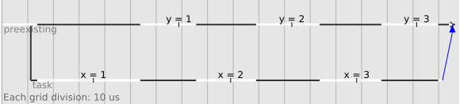

[API reference](https://ocaml-multicore.github.io/eio/)

# Eio -- Effects-Based Parallel IO for OCaml

Eio provides an effects-based direct-style IO stack for OCaml 5.0.
For example, you can use Eio to read and write files, make network connections,
or perform CPU-intensive calculations, running multiple operations at the same time.
It aims to be easy to use, secure, well documented, and fast.
A generic cross-platform API is implemented by optimised backends for different platforms.
Eio replaces existing concurrency libraries such as Lwt
(Eio and Lwt libraries can also be used together).

## Contents

<!-- vim-markdown-toc GFM -->

* [Motivation](#motivation)
* [Current Status](#current-status)
* [Structure of the Code](#structure-of-the-code)
* [Getting OCaml 5.0](#getting-ocaml-50)
* [Getting Eio](#getting-eio)
* [Running Eio](#running-eio)
* [Testing with Mocks](#testing-with-mocks)
* [Fibers](#fibers)
* [Tracing](#tracing)
* [Cancellation](#cancellation)
* [Racing](#racing)
* [Switches](#switches)
* [Performance](#performance)
* [Networking](#networking)
* [Design Note: Capabilities](#design-note-capabilities)
* [Buffered Reading and Parsing](#buffered-reading-and-parsing)
* [Buffered Writing](#buffered-writing)
* [Error Handling](#error-handling)
* [Filesystem Access](#filesystem-access)
* [Time](#time)
* [Multicore Support](#multicore-support)
* [Synchronisation Tools](#synchronisation-tools)
  * [Promises](#promises)
  * [Example: Concurrent Cache](#example-concurrent-cache)
  * [Streams](#streams)
  * [Example: Worker Pool](#example-worker-pool)
  * [The Rest: Mutex, Semaphore and Condition](#the-rest-mutex-semaphore-and-condition)
* [Design Note: Determinism](#design-note-determinism)
* [Provider Interfaces](#provider-interfaces)
* [Example Applications](#example-applications)
* [Integrations](#integrations)
  * [Async](#async)
  * [Lwt](#lwt)
  * [Unix and System Threads](#unix-and-system-threads)
* [Best Practices](#best-practices)
  * [Switches](#switches-1)
  * [Casting](#casting)
  * [Passing Stdenv.t](#passing-stdenvt)
* [Further Reading](#further-reading)

<!-- vim-markdown-toc -->

## Motivation

The `Unix` library provided with OCaml uses blocking IO operations, and is not well suited to concurrent programs such as network services or interactive applications.
For many years, the solution to this has been libraries such as Lwt and Async, which provide a monadic interface.
These libraries allow writing code as if there were multiple threads of execution, each with their own stack, but the stacks are simulated using the heap.

OCaml 5.0 adds support for "effects", removing the need for monadic code here.
Using effects brings several advantages:

1. It's faster, because no heap allocations are needed to simulate a stack.
2. Concurrent code can be written in the same style as plain non-concurrent code.
3. Because a real stack is used, backtraces from exceptions work as expected.
4. Other features of the language (such as `try ... with ...`) can be used in concurrent code.

Additionally, modern operating systems provide high-performance alternatives to the old Unix `select` call.
For example, Linux's io_uring system has applications write the operations they want to perform to a ring buffer,
which Linux handles asynchronously.

Due to this, we anticipate many OCaml users will want to rewrite their IO code once OCaml 5.0 is released.
It would be very beneficial to use this opportunity to standardise a single concurrency API for OCaml,
and we hope that Eio will be that API.

## Current Status

See [Eio 1.0 progress tracking](https://github.com/ocaml-multicore/eio/issues/388) for the current status.
Please try porting your programs to use Eio and submit PRs or open issues when you find problems.
Remember that you can always fall back to using Lwt libraries to provide missing features if necessary.

See [Awesome Multicore OCaml][] for links to work migrating other projects to Eio.

## Structure of the Code

- [Eio][] provides concurrency primitives (promises, etc.) and a high-level, cross-platform OS API.
- [Eio_luv][] provides a cross-platform backend for these APIs using [luv](https://github.com/aantron/luv) (libuv).
- [Eio_linux][] provides a Linux io-uring backend for these APIs,
  plus a low-level API that can be used directly (in non-portable code).
- [Eio_main][] selects an appropriate backend (e.g. `eio_linux` or `eio_luv`), depending on your platform.

## Getting OCaml 5.0

You'll need OCaml 5.0.0~rc1.
You can either install it yourself or build the included [Dockerfile](./Dockerfile).

To install it yourself:

1. Make sure you have opam 2.1 or later (run `opam --version` to check).

2. Use opam to install OCaml 5.0.0~rc1:

   ```
   opam switch create 5.0.0~rc1
   ```

## Getting Eio

If you want to run the latest development version from Git, run these commands
(otherwise, skip them and you'll get the latest release from opam):

```
git clone https://github.com/ocaml-multicore/eio.git
cd eio
opam pin -yn .
```

Either way, install `eio_main` (and `utop` if you want to try it interactively):

```
opam install eio_main utop
```

## Running Eio

Try out the examples interactively by running `utop` in the shell.

First `require` the `eio_main` library. It's also convenient to open the [Eio.Std][]
module, as follows. (The leftmost `#` shown below is the Utop prompt, so enter the text after the 
prompt and return after each line.)

```ocaml
# #require "eio_main";;
# open Eio.Std;;
```

This function writes a greeting to `stdout` using [Eio.Flow][]:

```ocaml
let main ~stdout =
  Eio.Flow.copy_string "Hello, world!\n" stdout
```

We use [Eio_main.run][] to run the event loop and call `main` from there:

```ocaml
# Eio_main.run @@ fun env ->
  main ~stdout:(Eio.Stdenv.stdout env);;
Hello, world!
- : unit = ()
```

Note that:

- The `env` argument represents the standard environment of a Unix process, allowing it to interact with the outside world.
  A program will typically start by extracting from `env` whatever things the program will need and then calling `main` with them.

- The type of the `main` function here tells us that this program only interacts via `stdout`.

- `Eio_main.run` automatically calls the appropriate run function for your platform.
  For example, on Linux this will call `Eio_linux.run`. For non-portable code you can use the platform-specific library directly.

This example can also be built using dune; see [examples/hello](./examples/hello/).

## Testing with Mocks

Because external resources are provided to `main` as arguments, we can easily replace them with mocks for testing.
For example, instead of giving `main` the real standard output, we can have it write to a buffer:

```ocaml
# Eio_main.run @@ fun _env ->
  let buffer = Buffer.create 20 in
  main ~stdout:(Eio.Flow.buffer_sink buffer);
  traceln "Main would print %S" (Buffer.contents buffer);;
+Main would print "Hello, world!\n"
- : unit = ()
```

[Eio.traceln][] provides convenient printf-style debugging, without requiring you to plumb `stderr` through your code.
It uses the `Format` module, so you can use the extended formatting directives here too.

The [Eio_mock][] library provides some convenient pre-built mocks:

```ocaml
# #require "eio.mock";;
# Eio_main.run @@ fun _env ->
  let mock_stdout = Eio_mock.Flow.make "mock-stdout" in
  main ~stdout:mock_stdout;;
+mock-stdout: wrote "Hello, world!\n"
- : unit = ()
```

## Fibers

Here's an example running two threads of execution concurrently using [Eio.Fiber][]:

```ocaml
let main _env =
  Fiber.both
    (fun () -> for x = 1 to 3 do traceln "x = %d" x; Fiber.yield () done)
    (fun () -> for y = 1 to 3 do traceln "y = %d" y; Fiber.yield () done);;
```

```ocaml
# Eio_main.run main;;
+x = 1
+y = 1
+x = 2
+y = 2
+x = 3
+y = 3
- : unit = ()
```

The two fibers run on a single core, so only one can be running at a time.
Calling an operation that performs an effect (such as `yield`) can switch to a different thread.

## Tracing

The library can write traces in CTF format, showing when threads (fibers) are created, when they run, and how they interact.
We can run the previous code with tracing enabled (writing to a new `trace.ctf` file) like this:

```ocaml
# let () =
    Eio_unix.Ctf.with_tracing "trace.ctf" @@ fun () ->
    Eio_main.run main;;
+x = 1
+y = 1
+x = 2
+y = 2
+x = 3
+y = 3
```

The trace can be viewed using [mirage-trace-viewer][].
This should work even while the program is still running.
The file is a ring buffer, so when it gets full, old events will start to be overwritten with new ones.

<p align='center'>
  
</p>

This shows the two counting threads as two horizonal lines.
The white regions indicate when each thread was running.
Note that the output from `traceln` appears in the trace as well as on the console.

## Cancellation

Every fiber has a [cancellation context][Eio.Cancel].
If one of the `Fiber.both` fibers fails, the other is cancelled:

```ocaml
# Eio_main.run @@ fun _env ->
  Fiber.both
    (fun () -> for x = 1 to 3 do traceln "x = %d" x; Fiber.yield () done)
    (fun () -> failwith "Simulated error");;
+x = 1
Exception: Failure "Simulated error".
```

What happened here was:

1. `Fiber.both` created a new cancellation context for the child fibers.
2. The first fiber ran, printed `x = 1` and yielded.
3. The second fiber raised an exception.
4. `Fiber.both` caught the exception and cancelled the context.
5. The first thread's `yield` raised a `Cancelled` exception there.
6. Once both threads had finished, `Fiber.both` re-raised the original exception.

There is a tree of cancellation contexts for each domain, and every fiber is in one context.
When an exception is raised, it propagates towards the root until handled, cancelling the other branches as it goes.
You should assume that any operation that can switch fibers can also raise a `Cancelled` exception if an uncaught exception
reaches one of its ancestor cancellation contexts.

If you want to make an operation non-cancellable, wrap it with `Cancel.protect`
(this creates a new context that isn't cancelled with its parent).

## Racing

`Fiber.first` returns the result of the first fiber to finish, cancelling the other one:

```ocaml
# Eio_main.run @@ fun _env ->
  let x =
    Fiber.first
      (fun () ->
        traceln "first fiber delayed...";
        Fiber.yield ();
        traceln "delay over";
        "a"
      )
      (fun () -> "b")
  in
  traceln "x = %S" x;;
+first fiber delayed...
+x = "b"
- : unit = ()
```

## Switches

A [switch][Eio.Switch] is used to group fibers together, so they can be waited on together.
This is a form of [structured concurrency][].
For example:

```ocaml
# Eio_main.run @@ fun _env ->
  Switch.run (fun sw ->
    Fiber.fork ~sw
      (fun () -> for i = 1 to 3 do traceln "i = %d" i; Fiber.yield () done);
    traceln "First thread forked";
    Fiber.fork ~sw
      (fun () -> for j = 1 to 3 do traceln "j = %d" j; Fiber.yield () done);
    traceln "Second thread forked; top-level code is finished"
  );
  traceln "Switch is finished";;
+i = 1
+First thread forked
+j = 1
+Second thread forked; top-level code is finished
+i = 2
+j = 2
+i = 3
+j = 3
+Switch is finished
- : unit = ()
```

`Switch.run fn` creates a new switch `sw` and runs `fn sw`.
`fn` may spawn new fibers and attach them to the switch.
It may also attach other resources such as open file handles.
`Switch.run` waits until `fn` and all other attached fibers have finished, and then
releases any attached resources (e.g. closing all attached file handles).

If you call a function without giving it access to a switch,
then when the function returns you can be sure that any fibers it spawned have finished,
and any files it opened have been closed.
This works because Eio does not provide e.g. a way to open a file without attaching it to a switch.
If a function doesn't have a switch and wants to open a file, it must use `Switch.run` to create one.
But then the function can't return until `Switch.run` does, at which point the file is closed.

So, a `Switch.run` puts a bound on the lifetime of things created within it,
leading to clearer code and avoiding resource leaks.
The `Fiber.fork` call above creates a new fiber that continues running after `fork` returns,
so it needs to take a switch argument.

Every switch also creates a new cancellation context.
You can use `Switch.fail` to mark the switch as failed and cancel all fibers within it.
The exception (or exceptions) passed to `fail` will be raised by `run` when the fibers have exited.

## Performance

As mentioned above, Eio allows you to supply your own implementations of its abstract interfaces.
This is in contrast to OCaml's standard library, which only operates on OS file descriptors.
You might wonder what the performance impact of this is.
Here's a simple implementation of `cat` using the standard OCaml functions:

```ocaml
# let () =
    let buf = Bytes.create 4096 in
    let rec copy () =
      match input stdin buf 0 4096 with
      | 0 -> ()
      | got ->
        output stdout buf 0 got;
        copy ()
    in
    copy ();;
```

And here is the equivalent using Eio:

```ocaml
# let () =
    Eio_main.run @@ fun env ->
    Eio.Flow.copy
      (Eio.Stdenv.stdin env)
      (Eio.Stdenv.stdout env);;
```

Testing on a fresh 10G file with [pv](https://www.ivarch.com/programs/pv.shtml) on my machine gives:

```
$ truncate -s 10G dummy

$ cat_ocaml_unix.exe <dummy | pv >/dev/null
10.0GiB 0:00:04 [2.33GiB/s]

$ cat                <dummy | pv >/dev/null
10.0GiB 0:00:04 [2.42GiB/s]

$ cat_ocaml_eio.exe  <dummy | pv >/dev/null
10.0GiB 0:00:03 [3.01GiB/s]
```

`Eio.Flow.copy src dst` asks `dst` to copy from `src`.
As `dst` here wraps a Unix file descriptor,
it first calls the `probe` method on the `src` object to check whether it does too.
Discovering that `src` is also wrapping a file descriptor, it switches to a faster code path optimised for that case.
On my machine, this code path uses the Linux-specific `splice` system call for maximum performance.

Note that not all cases are well-optimised yet, but the idea is for each backend to choose the most efficient way to implement the operation.

## Networking

Eio provides an API for [networking][Eio.Net].
Here is a client that connects to address `addr` using network `net` and sends a message:

```ocaml
let run_client ~net ~addr =
  traceln "Connecting to server...";
  Switch.run @@ fun sw ->
  let flow = Eio.Net.connect ~sw net addr in
  Eio.Flow.copy_string "Hello from client" flow
```

Note: the `flow` is attached to `sw` and will be closed automatically when it finishes.

We can test it using a mock network:

```ocaml
# Eio_main.run @@ fun _env ->
  let net = Eio_mock.Net.make "mocknet" in
  let socket = Eio_mock.Flow.make "socket" in
  Eio_mock.Net.on_connect net [`Return socket];
  run_client ~net ~addr:(`Tcp (Eio.Net.Ipaddr.V4.loopback, 8080));; 
+Connecting to server...
+mocknet: connect to tcp:127.0.0.1:8080
+socket: wrote "Hello from client"
+socket: closed
- : unit = ()
```

Here is a server that listens on `socket` and handles a single connection by reading a message:

```ocaml
let run_server socket =
  Switch.run @@ fun sw ->
  Eio.Net.accept_fork socket ~sw (fun flow _addr ->
    traceln "Server accepted connection from client";
    let b = Buffer.create 100 in
    Eio.Flow.copy flow (Eio.Flow.buffer_sink b);
    traceln "Server received: %S" (Buffer.contents b)
  ) ~on_error:(traceln "Error handling connection: %a" Fmt.exn);
  traceln "(normally we'd loop and accept more connections here)"
```

Notes:

- `accept_fork` handles the connection in a new fiber.
- Normally, a server would call `accept_fork` in a loop to handle multiple connections.
- When the handler passed to `accept_fork` finishes, `flow` is closed automatically.

This can also be tested on its own using a mock network:

```ocaml
# Eio_main.run @@ fun _env ->
  let listening_socket = Eio_mock.Net.listening_socket "tcp/80" in
  let mock_addr = `Tcp (Eio.Net.Ipaddr.V4.loopback, 37568) in
  let connection = Eio_mock.Flow.make "connection" in
  Eio_mock.Net.on_accept listening_socket [`Return (connection, mock_addr)];
  Eio_mock.Flow.on_read connection [
    `Return "(packet 1)";
    `Yield_then (`Return "(packet 2)");
    `Raise End_of_file;
  ];
  run_server listening_socket;;
+tcp/80: accepted connection from tcp:127.0.0.1:37568
+Server accepted connection from client
+connection: read "(packet 1)"
+(normally we'd loop and accept more connections here)
+connection: read "(packet 2)"
+Server received: "(packet 1)(packet 2)"
+connection: closed
- : unit = ()
```

We can now run them together using the real network (in a single process) using `Fiber.both`:

```ocaml
let main ~net ~addr =
  Switch.run @@ fun sw ->
  let server = Eio.Net.listen net ~sw ~reuse_addr:true ~backlog:5 addr in
  traceln "Server ready...";
  Fiber.both
    (fun () -> run_server server)
    (fun () -> run_client ~net ~addr)
```

```ocaml
# Eio_main.run @@ fun env ->
  main
    ~net:(Eio.Stdenv.net env)
    ~addr:(`Tcp (Eio.Net.Ipaddr.V4.loopback, 8080));;
+Server ready...
+Connecting to server...
+Server accepted connection from client
+(normally we'd loop and accept more connections here)
+Server received: "Hello from client"
- : unit = ()
```

See [examples/net](./examples/net/) for a more complete example.

## Design Note: Capabilities

Eio follows the principles of [capability-based security][].
The key idea here is that the lambda calculus already contains a perfectly good security system:
a function can only access things that are in its scope.
If we can avoid breaking this model (for example, by adding global variables to our language)
then we can reason about the security properties of code quite easily.

Consider the network example in the previous section.
Imagine this is a large program and we want to know:

1. Does this program modify the filesystem?
2. Does this program send telemetry data over the network?

In a capability-safe language, we don't have to read the entire code-base to find the answers:

- All authority starts at the (privileged) `Eio_main.run` function with the `env` parameter,
  so we must check this code.

- Only `env`'s network access is used, so we know this program doesn't access the filesystem,
  answering question 1 immediately.

- To check whether telemetry is sent, we need to follow the `net` authority as it is passed to `main`.

- `main` uses `net` to open a listening socket on the loopback interface, which it passes to `run_server`.
  `run_server` does not get the full `net` access, so we probably don't need to read that code; however,
  we might want to check whether we granted other parties access to this port on our loopback network.

- `run_client` does get `net`, so we do need to read that.
  We could make that code easier to audit by passing it `(fun () -> Eio.Net.connect net addr)` instead of `net` .
  Then we could see that `run_client` could only connect to our loopback address.

Some key features required for a capability system are:

1. The language must be memory-safe.
   OCaml allows all code to use e.g. `Obj.magic` or `Array.unsafe_set`.

2. The default scope must not provide access to the outside world.
   OCaml's `Stdlib.open_in` gives all code access to the file-system.

3. No top-level mutable state.
   In OCaml, if two libraries use a module `Foo` with top-level mutable state, then they could communicate using that
   without first being introduced to each other by the main application code.
   
4. APIs should make it easy to restrict access.
   For example, having a "directory" should allow access to that sub-tree of the file-system only.
   If the file-system abstraction provides a `get_parent` function then access to any directory is
   equivalent to access to everything.

Since OCaml is not a capability language, code can ignore Eio and use the non-capability APIs directly.
However, it still makes non-malicious code easier to understand and test
and may allow for an extension to the language in the future.
See [Emily][] for a previous attempt at this.

## Buffered Reading and Parsing

Reading from an Eio flow directly may give you more or less data than you wanted.
For example, if you want to read a line of text from a TCP stream,
the flow will tend to give you the data in packet-sized chunks, not lines.
To solve this, you can wrap the flow with a [buffer][Eio.Buf_read] and read from that.

Here's a simple command-line interface that reads `stdin` one line at a time:

```ocaml
let cli ~stdin ~stdout =
  let buf = Eio.Buf_read.of_flow stdin ~initial_size:100 ~max_size:1_000_000 in
  while true do
    let line = Eio.Buf_read.line buf in
    traceln "> %s" line;
    match line with
    | "h" | "help" -> Eio.Flow.copy_string "It's just an example\n" stdout
    | x -> Eio.Flow.copy_string (Fmt.str "Unknown command %S\n" x) stdout
  done
```

Let's try it with some test data (you could use the real stdin if you prefer):

```ocaml
# Eio_main.run @@ fun env ->
  cli
    ~stdin:(Eio.Flow.string_source "help\nexit\nquit\nbye\nstop\n")
    ~stdout:(Eio.Stdenv.stdout env);;
+> help
It's just an example
+> exit
Unknown command "exit"
+> quit
Unknown command "quit"
+> bye
Unknown command "bye"
+> stop
Unknown command "stop"
Exception: End_of_file.
```

`Buf_read.of_flow` allocates an internal buffer (with the given `initial_size`).
When you try to read a line from it, it will take a whole line from the buffer if possible.
If not, it will ask the underlying flow for the next chunk of data, until it has enough.

For high performance applications, you should use a larger initial buffer
so that fewer reads on the underlying flow are needed.

If the user enters a line that doesn't fit in the buffer then the buffer will be enlarged as needed.
However, it will raise an exception if the buffer would need to grow above `max_size`.
This is useful when handling untrusted input, since otherwise when you try to read one line an
attacker could just keep sending e.g. 'x' characters until your service ran out of memory and crashed.

As well as calling individual parsers (like `line`) directly,
you can also build larger parsers from smaller ones.
For example:

```ocaml
open Eio.Buf_read.Syntax

type message = { src : string; body : string }

let message =
  let+ src = Eio.Buf_read.(string "FROM:" *> line) 
  and+ body = Eio.Buf_read.take_all in
  { src; body }
```

```ocaml
# Eio_main.run @@ fun _ ->
  let flow = Eio.Flow.string_source "FROM:Alice\nHello!\n" in
  match Eio.Buf_read.parse message flow ~max_size:1024 with
  | Ok { src; body } -> traceln "%s sent %S" src body
  | Error (`Msg err) -> traceln "Parse failed: %s" err;;
+Alice sent "Hello!\n"
- : unit = ()
```

## Buffered Writing

For performance, it's often useful to batch up writes and send them all in one go.
For example, consider sending an HTTP response without buffering:

```ocaml
let send_response socket =
  Eio.Flow.copy_string "HTTP/1.1 200 OK\r\n" socket;
  Eio.Flow.copy_string "\r\n" socket;
  Fiber.yield ();       (* Simulate delayed generation of body *)
  Eio.Flow.copy_string "Body data" socket
```

```ocaml
# Eio_main.run @@ fun _ ->
  send_response (Eio_mock.Flow.make "socket");;
+socket: wrote "HTTP/1.1 200 OK\r\n"
+socket: wrote "\r\n"
+socket: wrote "Body data"
- : unit = ()
```

The socket received three writes, perhaps sending three separate packets over the network.
We can wrap a flow with [Eio.Buf_write][] to avoid this:

```ocaml
module Write = Eio.Buf_write

let send_response socket =
  Write.with_flow socket @@ fun w ->
  Write.string w "HTTP/1.1 200 OK\r\n";
  Write.string w "\r\n";
  Fiber.yield ();       (* Simulate delayed generation of body *)
  Write.string w "Body data"
```

```ocaml
# Eio_main.run @@ fun _ ->
  send_response (Eio_mock.Flow.make "socket");;
+socket: wrote "HTTP/1.1 200 OK\r\n"
+              "\r\n"
+socket: wrote "Body data"
- : unit = ()
```

Now the first two writes were combined and sent together.

## Error Handling

Errors interacting with the outside world are indicated by the `Eio.Io (err, context)` exception.
This is roughly equivalent to the `Unix.Unix_error` exception from the OCaml standard library.

The `err` field describes the error using nested error codes,
allowing you to match on either specific errors or whole classes of errors at once.
For example:

```ocaml
let test r =
  try Eio.Buf_read.line r
  with
  | Eio.Io (Eio.Net.E Connection_reset Eio_luv.Luv_error _, _) -> "Luv connection reset"
  | Eio.Io (Eio.Net.E Connection_reset _, _) -> "Connection reset"
  | Eio.Io (Eio.Net.E _, _) -> "Some network error"
  | Eio.Io _ -> "Some I/O error"
```

For portable code, you will want to avoid matching backend-specific errors, so you would avoid the first case.
The `Eio.Io` type is extensible, so libraries can also add additional top-level error types if needed.

`Io` errors also allow adding extra context information to the error.
For example, this HTTP GET function adds the URL to any IO error:

```ocaml
# let get ~net ~host ~path =
    try
      Eio.Net.with_tcp_connect net ~host ~service:"http" @@ fun _flow ->
      "..."
    with Eio.Io _ as ex ->
      let bt = Printexc.get_raw_backtrace () in
      Eio.Exn.reraise_with_context ex bt "fetching http://%s/%s" host path;;
val get : net:#Eio.Net.t -> host:string -> path:string -> string = <fun>
```

If we test it using a mock network that returns a timeout,
we get a useful error message telling us the IP address and port of the failed attempt,
extended with the hostname we used to get that,
and then extended again by our `get` function with the full URL:

```ocaml
# Eio_mock.Backend.run @@ fun () ->
  let net = Eio_mock.Net.make "mocknet" in
  Eio_mock.Net.on_getaddrinfo net [`Return [`Tcp (Eio.Net.Ipaddr.V4.loopback, 80)]];
  Eio_mock.Net.on_connect net [`Raise (Eio.Net.err (Connection_failure Timeout))];
  get ~net ~host:"example.com" ~path:"index.html";;
+mocknet: getaddrinfo ~service:http example.com
+mocknet: connect to tcp:127.0.0.1:80
Exception:
Eio.Io Net Connection_failure Timeout,
  connecting to tcp:127.0.0.1:80,
  connecting to "example.com":http,
  fetching http://example.com/index.html
```

To get more detailed information, you can enable backtraces by setting `OCAMLRUNPARAM=b`
or by calling `Printexc.record_backtrace true`, as usual.

When writing MDX tests that depend on getting the exact error output,
it can be annoying to have the full backend-specific error displayed:

<!-- $MDX non-deterministic=command -->
```ocaml
# Eio_main.run @@ fun env ->
  let net = Eio.Stdenv.net env in
  Switch.run @@ fun sw ->
  Eio.Net.connect ~sw net (`Tcp (Eio.Net.Ipaddr.V4.loopback, 1234));;
Exception:
Eio.Io Net Connection_failure Refused Eio_luv.Luv_error(ECONNREFUSED) (* connection refused *),
  connecting to tcp:127.0.0.1:1234
```

If we ran this using e.g. the Linux io_uring backend, the `Luv_error` part would change.
To avoid this problem, you can use `Eio.Exn.Backend.show` to hide the backend-specific part of errors:

```ocaml
# Eio.Exn.Backend.show := false;;
- : unit = ()

# Eio_main.run @@ fun env ->
  let net = Eio.Stdenv.net env in
  Switch.run @@ fun sw ->
  Eio.Net.connect ~sw net (`Tcp (Eio.Net.Ipaddr.V4.loopback, 1234));;
Exception:
Eio.Io Net Connection_failure Refused _,
  connecting to tcp:127.0.0.1:1234
```

We'll leave it like that for the rest of this file,
so the examples can be tested automatically by MDX.

## Filesystem Access

Access to the filesystem is performed using [Eio.Path][].
An `'a Path.t` is a pair of a capability to a base directory (of type `'a`) and a string path relative to that.
To append to the string part, it's convenient to use the `/` operator:

```ocaml
let ( / ) = Eio.Path.( / )
```

`env` provides two initial paths:

- `cwd` restricts access to files beneath the current working directory.
- `fs` provides full access (just like OCaml's stdlib).

You can save a whole file using `Path.save`:

```ocaml
# Eio_main.run @@ fun env ->
  let path = Eio.Stdenv.cwd env / "test.txt" in
  traceln "Saving to %a" Eio.Path.pp path;
  Eio.Path.save ~create:(`Exclusive 0o600) path "line one\nline two\n";;
+Saving to <cwd:test.txt>
- : unit = ()
```

For more control, use `Path.open_out` (or `with_open_out`) to get a flow.

To load a file, you can use `load` to read the whole thing into a string,
`Path.open_in` (or `with_open_in`) to get a flow, or `Path.with_lines` to stream
the lines (a convenience function that uses `Buf_read.lines`):

```ocaml
# Eio_main.run @@ fun env ->
  let path = Eio.Stdenv.cwd env / "test.txt" in
  Eio.Path.with_lines path (fun lines ->
     Seq.iter (traceln "Processing %S") lines
  );;
+Processing "line one"
+Processing "line two"
- : unit = ()
```

Access to `cwd` only grants access to that sub-tree:

```ocaml
let try_save path data =
  match Eio.Path.save ~create:(`Exclusive 0o600) path data with
  | () -> traceln "save %a : ok" Eio.Path.pp path
  | exception ex -> traceln "%a" Eio.Exn.pp ex

let try_mkdir path =
  match Eio.Path.mkdir path ~perm:0o700 with
  | () -> traceln "mkdir %a : ok" Eio.Path.pp path
  | exception ex -> traceln "%a" Eio.Exn.pp ex
```

```ocaml
# Eio_main.run @@ fun env ->
  let cwd = Eio.Stdenv.cwd env in
  try_mkdir (cwd / "dir1");
  try_mkdir (cwd / "../dir2");
  try_mkdir (cwd / "/tmp/dir3");;
+mkdir <cwd:dir1> : ok
+Eio.Io Fs Permission_denied _, creating directory <cwd:../dir2>
+Eio.Io Fs Permission_denied _, creating directory <cwd:/tmp/dir3>
- : unit = ()
```

The checks also apply to following symlinks:

```ocaml
# Unix.symlink "dir1" "link-to-dir1"; Unix.symlink "/tmp" "link-to-tmp";;
- : unit = ()

# Eio_main.run @@ fun env ->
  let cwd = Eio.Stdenv.cwd env in
  try_save (cwd / "dir1/file1") "A";
  try_save (cwd / "link-to-dir1/file2") "B";
  try_save (cwd / "link-to-tmp/file3") "C";;
+save <cwd:dir1/file1> : ok
+save <cwd:link-to-dir1/file2> : ok
+Eio.Io Fs Permission_denied _, opening <cwd:link-to-tmp/file3>
- : unit = ()
```

You can use `open_dir` (or `with_open_dir`) to create a restricted capability to a subdirectory:

```ocaml
# Eio_main.run @@ fun env ->
  let cwd = Eio.Stdenv.cwd env in
  Eio.Path.with_open_dir (cwd / "dir1") @@ fun dir1 ->
  try_save (dir1 / "file4") "D";
  try_save (dir1 / "../file5") "E";;
+save <dir1:file4> : ok
+Eio.Io Fs Permission_denied _, opening <dir1:../file5>
- : unit = ()
```

You only need to use `open_dir` if you want to create a new sandboxed environment.
You can use a single base directory object to access all paths beneath it,
and this allows following symlinks within that subtree.

A program that operates on the current directory will probably want to use `cwd`,
whereas a program that accepts a path from the user will probably want to use `fs`,
perhaps with `open_dir` to constrain all access to be within that directory.

Note: the `eio_luv` backend doesn't have the `openat`, `mkdirat`, etc.,
calls that are necessary to implement these checks without races,
so be careful if symlinks out of the subtree may be created while the program is running.

## Time

The standard environment provides a [clock][Eio.Time] with the usual POSIX time:

```ocaml
# Eio_main.run @@ fun env ->
  let clock = Eio.Stdenv.clock env in
  traceln "The time is now %f" (Eio.Time.now clock);
  Eio.Time.sleep clock 1.0;
  traceln "The time is now %f" (Eio.Time.now clock);;
+The time is now 1623940778.270336
+The time is now 1623940779.270336
- : unit = ()
```

You might like to replace this clock with a mock for tests.
In fact, this README does just that! See [doc/prelude.ml](doc/prelude.ml) for the fake clock used in the example above.

## Multicore Support

Fibers are scheduled cooperatively within a single domain, but you can also create new domains that run in parallel.
This is useful to perform CPU-intensive operations quickly.
For example, let's say we have a CPU intensive task:

```ocaml
let sum_to n =
  traceln "Starting CPU-intensive task...";
  let total = ref 0 in
  for i = 1 to n do
    total := !total + i
  done;
  traceln "Finished";
  !total
```

We can use [Eio.Domain_manager][] to run this in a separate domain:

```ocaml
let main ~domain_mgr =
  let test n =
    traceln "sum 1..%d = %d" n
      (Eio.Domain_manager.run domain_mgr
        (fun () -> sum_to n))
  in
  Fiber.both
    (fun () -> test 100000)
    (fun () -> test 50000)
```

<!-- $MDX non-deterministic=output -->
```ocaml
# Eio_main.run @@ fun env ->
  main ~domain_mgr:(Eio.Stdenv.domain_mgr env);;
+Starting CPU-intensive task...
+Starting CPU-intensive task...
+Finished
+sum 1..50000 = 1250025000
+Finished
+sum 1..100000 = 5000050000
- : unit = ()
```

Notes:

- `traceln` can be used safely from multiple domains.
  It takes a mutex, so that trace lines are output atomically.
- The exact `traceln` output of this example is non-deterministic,
  because the OS is free to schedule domains as it likes.
- You must ensure that the function passed to `run` doesn't have access to any non-threadsafe values.
  The type system does not check this.
- `run` waits for the domain to finish, but it allows other fibers to run while waiting.
  This is why we use `Fiber.both` to create multiple fibers.

For more information, see the [Multicore Guide](./doc/multicore.md).

## Synchronisation Tools

Eio provides several sub-modules for communicating between fibers,
and these work even when the fibers are running in different domains.

### Promises

[Promises][Eio.Promise] are a simple and reliable way to communicate between fibers.
One fiber can wait for a promise and another can resolve it:

```ocaml
# Eio_main.run @@ fun _ ->
  let promise, resolver = Promise.create () in
  Fiber.both
    (fun () ->
      traceln "Waiting for promise...";
      let x = Promise.await promise in
      traceln "x = %d" x
    )
    (fun () ->
      traceln "Resolving promise";
      Promise.resolve resolver 42
    );;
+Waiting for promise...
+Resolving promise
+x = 42
- : unit = ()
```

A promise is initially "unresolved", and can only be resolved once.
Awaiting a promise that is already resolved immediately returns the resolved value.

Promises are one of the easiest tools to use safely:
it doesn't matter whether you wait on a promise before or after it is resolved,
and multiple fibers can wait for the same promise and will get the same result.
Promises are thread-safe; you can wait for a promise in one domain and resolve it in another.

Promises are also useful for integrating with callback-based libraries. For example:

```ocaml
let wrap fn x =
  let promise, resolver = Promise.create () in
  fn x
    ~on_success:(Promise.resolve_ok resolver)
    ~on_error:(Promise.resolve_error resolver);
  Promise.await_exn promise
```

### Example: Concurrent Cache

Here's an example using promises to cache lookups,
with the twist that another user might ask the cache for the value while it's still adding it.
We don't want to start a second fetch in that case, so instead we just store promises in the cache:

```ocaml
let make_cache fn =
  let tbl = Hashtbl.create 10 in
  fun key ->
    match Hashtbl.find_opt tbl key with
    | Some p -> Promise.await_exn p
    | None ->
      let p, r = Promise.create () in
      Hashtbl.add tbl key p;
      match fn key with
      | v -> Promise.resolve_ok r v; v
      | exception ex -> Promise.resolve_error r ex; raise ex
```

Notice that we store the new promise in the cache immediately,
without doing anything that might switch to another fiber.

We can use it like this:

```ocaml
# let fetch url =
    traceln "Fetching %S..." url;
    Fiber.yield ();             (* Simulate work... *)
    traceln "Got response for %S" url;
    if url = "http://example.com" then "<h1>Example.com</h1>"
    else failwith "404 Not Found";;
val fetch : string -> string = <fun>

# Eio_main.run @@ fun _ ->
  let c = make_cache fetch in
  let test url =
    traceln "Requesting %s..." url;
    match c url with
    | page -> traceln "%s -> %s" url page
    | exception ex -> traceln "%s -> %a" url Fmt.exn ex
  in
  Fiber.List.iter test [
    "http://example.com";
    "http://example.com";
    "http://bad.com";
    "http://bad.com";
  ];;
+Requesting http://example.com...
+Fetching "http://example.com"...
+Requesting http://example.com...
+Requesting http://bad.com...
+Fetching "http://bad.com"...
+Requesting http://bad.com...
+Got response for "http://example.com"
+http://example.com -> <h1>Example.com</h1>
+Got response for "http://bad.com"
+http://bad.com -> Failure("404 Not Found")
+http://example.com -> <h1>Example.com</h1>
+http://bad.com -> Failure("404 Not Found")
- : unit = ()
```

`Fiber.List.iter` is like `List.iter` but doesn't wait for each job to finish before starting the next.
Notice that we made four requests, but only started two download operations.

This version of the cache remembers failed lookups too.
You could modify it to remove the entry on failure,
so that all clients currently waiting still fail,
but any future client asking for the failed resource will trigger a new download.

This cache is not thread-safe.
You will need to add a mutex if you want to share it between domains.

### Streams

A [stream][Eio.Stream] is a bounded queue. Reading from an empty stream waits until an item is available.
Writing to a full stream waits for space.

```ocaml
# Eio_main.run @@ fun _ ->
  let stream = Eio.Stream.create 2 in
  Fiber.both
    (fun () ->
       for i = 1 to 5 do
         traceln "Adding %d..." i;
         Eio.Stream.add stream i
       done
    )
    (fun () ->
       for i = 1 to 5 do
         let x = Eio.Stream.take stream in
         traceln "Got %d" x;
         Fiber.yield ()
       done
    );;
+Adding 1...
+Adding 2...
+Adding 3...
+Got 1
+Adding 4...
+Got 2
+Adding 5...
+Got 3
+Got 4
+Got 5
- : unit = ()
```

Here, we create a stream with a maximum size of 2 items.
The first fiber added 1 and 2 to the stream, but had to wait before it could insert 3.

A stream with a capacity of 1 acts like a mailbox.
A stream with a capacity of 0 will wait until both the sender and receiver are ready.

Streams are thread-safe and can be used to communicate between domains.

### Example: Worker Pool

A useful pattern is a pool of workers reading from a stream of work items.
Client fibers submit items to a stream and workers process the items:

```ocaml
let handle_job request =
  Fiber.yield ();       (* (simulated work) *)
  Printf.sprintf "Processed:%d" request

let run_worker id stream =
  traceln "Worker %s ready" id;
  while true do
    let request, reply = Eio.Stream.take stream in
    traceln "Worker %s processing request %d" id request;
    Promise.resolve reply (handle_job request)
  done

let submit stream request =
  let reply, resolve_reply = Promise.create () in
  Eio.Stream.add stream (request, resolve_reply);
  Promise.await reply
```

Each item in the stream is a request payload and a resolver for the reply promise.

```ocaml
# Eio_main.run @@ fun env ->
  let domain_mgr = Eio.Stdenv.domain_mgr env in
  Switch.run @@ fun sw ->
  let stream = Eio.Stream.create 100 in
  let spawn_worker name =
    Fiber.fork ~sw (fun () ->
       Eio.Domain_manager.run domain_mgr (fun () -> run_worker name stream)
    )
  in
  spawn_worker "A";
  spawn_worker "B";
  Switch.run (fun sw ->
     for i = 1 to 3 do
       Fiber.fork ~sw (fun () ->
         traceln "Client %d submitting job..." i;
         traceln "Client %d got %s" i (submit stream i)
       );
       Fiber.yield ()
     done;
  );
  raise Exit;;
+Worker A ready
+Worker B ready
+Client 1 submitting job...
+Worker A processing request 1
+Client 2 submitting job...
+Worker B processing request 2
+Client 3 submitting job...
+Client 1 got Processed:1
+Worker A processing request 3
+Client 2 got Processed:2
+Client 3 got Processed:3
Exception: Stdlib.Exit.
```

In the code above, any exception raised while processing a job will exit the whole program.
We might prefer to handle exceptions by sending them back to the client and continuing:

```ocaml
let run_worker id stream =
  traceln "Worker %s ready" id;
  while true do
    let request, reply = Eio.Stream.take stream in
    traceln "Worker %s processing request %d" id request;
    match handle_job request with
    | result -> Promise.resolve_ok reply result
    | exception ex -> Promise.resolve_error reply ex; Fiber.check ()
  done
```

The `Fiber.check ()` checks whether the worker itself has been cancelled, and exits the loop if so.
It's not actually necessary in this case,
because if we continue instead then the following `Stream.take` will perform the check anyway.

### The Rest: Mutex, Semaphore and Condition

Eio also provides `Mutex`, `Semaphore` and `Condition` sub-modules.
Each of these corresponds to the module with the same name in the OCaml standard library,
but allows other fibers to run while waiting instead of blocking the whole domain.
They are all safe to use in parallel from multiple domains.

- [Eio.Mutex][] provides *mutual exclusion*, so that only one fiber can access a resource at a time.
- [Eio.Semaphore][] generalises this to allow up to *n* fibers to access a resource at once.
- [Eio.Condition][] allows a fiber to wait until some condition is true.

For example, if we allow loading and saving data in a file there could be a problem
if we try to load the data while a save is in progress.
Protecting the file with a mutex will prevent that:

```ocaml
module Atomic_file = struct
  type 'a t = {
    path : 'a Eio.Path.t;
    mutex : Eio.Mutex.t;
  }

  let of_path path =
    { path; mutex = Eio.Mutex.create () }

  let save t data =
    Eio.Mutex.use_rw t.mutex ~protect:true (fun () ->
       Eio.Path.save t.path data ~create:(`Or_truncate 0o644)
    )

  let load t =
    Eio.Mutex.use_ro t.mutex (fun () ->
       Eio.Path.load t.path
    )
end
```

The `~protect:true` in `save` makes the critical section non-cancellable,
so that if a cancel happens during a save then we will finish writing the data first.
It can be used like this:

```ocaml
# Eio_main.run @@ fun env ->
  let dir = Eio.Stdenv.cwd env in
  let t = Atomic_file.of_path (dir / "data") in
  Fiber.both
    (fun () -> Atomic_file.save t "some data")
    (fun () ->
      let data = Atomic_file.load t in
      traceln "Loaded: %S" data
    );;
+Loaded: "some data"
- : unit = ()
```

Note: In practice, a better way to make file writes atomic is
to write the data to a temporary file and then atomically rename it over the old data.
That will work even if the whole computer crashes, and does not delay cancellation.

If the operation being performed is very fast (such as updating some in-memory counters),
then it is fine to use the standard library's `Mutex` instead.

If the operation does not switch fibers *and* the resource is only accessed from one domain,
then no mutex is needed at all. For example:

```ocaml
(* No mutex needed if only used from a single domain: *)

let in_use = ref 10
let free = ref 0

let release () =
  incr free;
  decr in_use
```

## Design Note: Determinism

Within a domain, fibers are scheduled deterministically.
Programs using only the Eio APIs can only behave non-deterministically if given a capability to do so from somewhere else.

For example, `Fiber.both f g` always starts running `f` first,
and only switches to `g` when `f` finishes or performs an effect that can switch fibers.

Performing IO with external objects (e.g., `stdout`, files, or network sockets) will introduce non-determinism,
as will using multiple domains.

Note that `traceln` is unusual. Although it writes (by default) to stderr, it will not switch fibers.
Instead, if the OS is not ready to receive trace output, the whole domain is paused until it is ready.
This means that adding `traceln` to deterministic code will not affect its scheduling.

In particular, if you test your code by providing (deterministic) mocks then the tests will be deterministic.
An easy way to write tests is by having the mocks call `traceln` and then comparing the trace output with the expected output.
See Eio's own tests for examples, e.g., [tests/switch.md](tests/switch.md).

## Provider Interfaces

Eio applications use resources by calling functions (such as `Eio.Flow.write`).
These functions are actually wrappers that call methods on the resources.
This allows you to define your own resources.

Here's a flow that produces an endless stream of zeros (like "/dev/zero"):

```ocaml
let zero = object
  inherit Eio.Flow.source

  method read_into buf =
    Cstruct.memset buf 0;
    Cstruct.length buf
end
```

It can then be used like any other Eio flow:

```ocaml
# Eio_main.run @@ fun _ ->
  let r = Eio.Buf_read.of_flow zero ~max_size:100 in
  traceln "Got: %S" (Eio.Buf_read.take 4 r);;
+Got: "\000\000\000\000"
- : unit = ()
```

The `Flow.source` interface has some extra methods that can be used for optimisations
(for example, instead of filling a buffer with zeros it could be more efficient to share
a pre-allocated block of zeros).
Using `inherit` provides default implementations of these methods that say no optimisations are available.
It also protects you somewhat from API changes in future, as defaults can be provided for any new methods that get added.

Although it is possible to *use* an object by calling its methods directly,
it is recommended that you use the functions instead.
The functions provide type information to the compiler, leading to clearer error messages,
and may provide extra features or sanity checks.

For example `Eio.Flow.single_read` is defined as:

```ocaml
let single_read (t : #Eio.Flow.source) buf =
  let got = t#read_into buf in
  assert (got > 0 && got <= Cstruct.length buf);
  got
```

As an exception to this rule, it is fine to use the methods of `env` directly
(e.g. using `main env#stdin` instead of `main (Eio.Stdenv.stdin env)`.
Here, the compiler already has the type from the `Eio_main.run` call immediately above it,
and `env` is acting as a simple record.
We avoid doing that in this guide only to avoid alarming OCaml users unfamiliar with object syntax.

See [Dynamic Dispatch](doc/rationale.md#dynamic-dispatch) for more discussion about the use of objects here.

## Example Applications

- [gemini-eio][] is a simple Gemini browser. It shows how to integrate Eio with `ocaml-tls`, `angstrom`, and `notty`.
- [ocaml-multicore/retro-httpaf-bench](https://github.com/ocaml-multicore/retro-httpaf-bench) includes a simple HTTP server using Eio. It shows how to use Eio with `httpaf`, and how to use multiple domains for increased performance.
- [Awesome Multicore OCaml][] lists many other projects.

## Integrations

Eio can be used with several other IO libraries.

### Async

[Async_eio][] has experimental support for running Async and Eio code together in a single domain.

### Lwt

You can use [Lwt_eio][] to run Lwt threads and Eio fibers together in a single domain,
and to convert between Lwt and Eio promises.
This may be useful during the process of porting existing code to Eio.

### Unix and System Threads

The [Eio_unix][] module provides features for using Eio with OCaml's Unix module.
In particular, `Eio_unix.run_in_systhread` can be used to run a blocking operation in a separate systhread,
allowing it to be used within Eio without blocking the whole domain.

## Best Practices

This section contains some recommendations for designing library APIs for use with Eio.

### Switches

A function should not take a switch argument if it could create one internally instead.

Taking a switch indicates that a function creates resources that outlive the function call,
and users seeing a switch argument will naturally wonder what these resources may be
and what lifetime to give them, which is confusing if this is not needed.

Creating the switch inside your function ensures that all resources are released
promptly.

```ocaml
(* BAD - switch should be created internally instead *)
let load_config ~sw path =
  parse_config (Eio.Path.open_in ~sw path)

(* GOOD - less confusing and closes file promptly *)
let load_config path =
  Switch.run @@ fun sw ->
  parse_config (Eio.Path.open_in ~sw path)
```

Of course, you could use `with_open_in` in this case to simplify it further.

### Casting

Unlike many languages, OCaml does not automatically cast objects (polymorphic records) to super-types as needed.
Remember to keep the type polymorphic in your interface so users don't need to do this manually.
This is similar to the case with polymorphic variants (where APIs should use `[< ...]` or `[> ...]`).

For example, if you need an `Eio.Flow.source` then users should be able to use a `Flow.two_way`
without having to cast it first:

<!-- $MDX skip -->
```ocaml
(* BAD - user must cast to use function: *)
module Message : sig
  type t
  val read : Eio.Flow.source -> t
end

(* GOOD - a Flow.two_way can be used without casting: *)
module Message : sig
  type t
  val read : #Eio.Flow.source -> t
end
```

If you want to store the argument, this may require you to cast internally:

```ocaml
module Foo : sig
  type t
  val of_source : #Eio.Flow.source -> t
end = struct
  type t = {
    src : Eio.Flow.source;
  }

  let of_source x = {
    src = (x :> Eio.Flow.source);
  }
end
```

Note: the `#type` syntax only works on types defined by classes, whereas the slightly more verbose `<type; ..>` works on all object types.

### Passing Stdenv.t

The `env` value you get from `Eio_main.run` is a powerful capability,
and programs are easier to understand when it's not passed around too much.

In many cases, it's clearer (if a little more verbose) to take the resources you need as separate arguments, e.g.

<!-- $MDX skip -->
```ocaml
module Status : sig
  val check :
    clock:#Eio.Time.clock ->
    net:#Eio.Net.t ->
    bool
end
```

You can also provide a convenience function that takes an `env` too.
Doing this is most appropriate if many resources are needed and
your library is likely to be initialised right at the start of the user's application.

In that case, be sure to request only the resources you need, rather than the full set.
This makes it clearer what you library does, makes it easier to test,
and allows it to be used on platforms without the full set of OS resources.
If you define the type explicitly, you can describe why you need each resource there:

<!-- $MDX skip -->
```ocaml
module Status : sig
  type 'a env = <
    net : #Eio.Net.t;             (** To connect to the servers *)
    clock : #Eio.Time.clock;      (** Needed for timeouts *)
    ..
  > as 'a

  val check : _ env -> bool
end
```


## Further Reading

- [lib_eio/eio.mli](lib_eio/eio.mli) documents Eio's public API.
- [doc/rationale.md](doc/rationale.md) describes some of Eio's design tradeoffs in more detail.
- [lib_eio/mock/backend.ml](lib_eio/mock/backend.ml) is a skeleton Eio backend with no actual IO.

Some background about the effects system can be found in:

- [Experiences with effects (video)](https://watch.ocaml.org/videos/watch/74ece0a8-380f-4e2a-bef5-c6bb9092be89), OCaml Workshop 2021.
- ["Retrofitting Concurrency onto OCaml"](https://kcsrk.info/papers/retro-concurrency_pldi_21.pdf) (to appear, PLDI 2021)
- https://kcsrk.info/ocaml/multicore/2015/05/20/effects-multicore/
- Effects examples: https://github.com/ocaml-multicore/effects-examples/tree/master/aio
- [Concurrent System Programming with Effect Handlers](https://www.repository.cam.ac.uk/bitstream/handle/1810/283239/paper.pdf?sequence=3&isAllowed=y)
- [Asynchronous effect based IO using effect handlers](https://github.com/kayceesrk/ocaml-aeio)

[Lwt_eio]: https://github.com/ocaml-multicore/lwt_eio
[mirage-trace-viewer]: https://github.com/talex5/mirage-trace-viewer
[structured concurrency]: https://en.wikipedia.org/wiki/Structured_concurrency
[capability-based security]: https://en.wikipedia.org/wiki/Object-capability_model
[Emily]: https://www.hpl.hp.com/techreports/2006/HPL-2006-116.pdf
[gemini-eio]: https://gitlab.com/talex5/gemini-eio
[Awesome Multicore OCaml]: https://github.com/patricoferris/awesome-multicore-ocaml
[Eio]: https://ocaml-multicore.github.io/eio/eio/Eio/index.html
[Eio.Std]: https://ocaml-multicore.github.io/eio/eio/Eio/Std/index.html
[Eio.Fiber]: https://ocaml-multicore.github.io/eio/eio/Eio/Fiber/index.html
[Eio.Flow]: https://ocaml-multicore.github.io/eio/eio/Eio/Flow/index.html
[Eio.Cancel]: https://ocaml-multicore.github.io/eio/eio/Eio/Cancel/index.html
[Eio.Switch]: https://ocaml-multicore.github.io/eio/eio/Eio/Switch/index.html
[Eio.Net]: https://ocaml-multicore.github.io/eio/eio/Eio/Net/index.html
[Eio.Buf_read]: https://ocaml-multicore.github.io/eio/eio/Eio/Buf_read/index.html
[Eio.Buf_write]: https://ocaml-multicore.github.io/eio/eio/Eio/Buf_write/index.html
[Eio.Path]: https://ocaml-multicore.github.io/eio/eio/Eio/Path/index.html
[Eio.Time]: https://ocaml-multicore.github.io/eio/eio/Eio/Time/index.html
[Eio.Domain_manager]: https://ocaml-multicore.github.io/eio/eio/Eio/Domain_manager/index.html
[Eio.Promise]: https://ocaml-multicore.github.io/eio/eio/Eio/Promise/index.html
[Eio.Stream]: https://ocaml-multicore.github.io/eio/eio/Eio/Stream/index.html
[Eio_luv]: https://ocaml-multicore.github.io/eio/eio_luv/Eio_luv/index.html
[Eio_linux]: https://ocaml-multicore.github.io/eio/eio_linux/Eio_linux/index.html
[Eio_main]: https://ocaml-multicore.github.io/eio/eio_main/Eio_main/index.html
[Eio.traceln]: https://ocaml-multicore.github.io/eio/eio/Eio/index.html#val-traceln
[Eio_main.run]: https://ocaml-multicore.github.io/eio/eio_main/Eio_main/index.html#val-run
[Eio_mock]: https://ocaml-multicore.github.io/eio/eio/Eio_mock/index.html
[Eio_unix]: https://ocaml-multicore.github.io/eio/eio/Eio_unix/index.html
[Async_eio]: https://github.com/talex5/async_eio
[Eio.Mutex]: https://ocaml-multicore.github.io/eio/eio/Eio/Mutex/index.html
[Eio.Semaphore]: https://ocaml-multicore.github.io/eio/eio/Eio/Semaphore/index.html
[Eio.Condition]: https://ocaml-multicore.github.io/eio/eio/Eio/Condition/index.html
