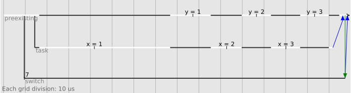

# eio -- effects based parallel IO for OCaml

This library implements an effects-based direct-style IO
stack for multicore OCaml.

The library is very much a work-in-progress, so this is an
unreleased repository.

## Contents

<!-- vim-markdown-toc GFM -->

* [Motivation](#motivation)
* [Structure of the code](#structure-of-the-code)
* [Getting started](#getting-started)
* [Testing with mocks](#testing-with-mocks)
* [Fibres](#fibres)
* [Tracing](#tracing)
* [Switches, errors and cancellation](#switches-errors-and-cancellation)
* [Performance](#performance)
* [Networking](#networking)
* [Further reading](#further-reading)

<!-- vim-markdown-toc -->

## Motivation

The `Unix` library provided with OCaml uses blocking IO operations, and is not well suited to concurrent programs such as network services or interactive applications.
For many years, the solution to this has been libraries such as Lwt and Async, which provide a monadic interface.
These libraries allow writing code as if there were multiple threads of execution, each with their own stack, but the stacks are simulated using the heap.

The multicore version of OCaml adds support for "effects", removing the need for monadic code here.
Using effects brings several advantages:

1. It is faster, because no heap allocations are needed to simulate a stack.
2. Concurrent code can be written in the same style as plain non-concurrent code.
3. Because a real stack is used, backtraces from exceptions work as expected.
4. Other features of the language (such as `try ... with ...`) can be used in concurrent code.

In addition, modern operating systems provide high-performance alternatives to the old Unix `select` call.
For example, Linux's io-uring system has applications write the operations they want to perform to a ring buffer,
which Linux handles asynchronously.

Due to this, we anticipate many OCaml users will want to rewrite their IO code at some point,
once effects have been merged into the the official version of OCaml.
It would be very beneficial if we could use this opportunity to standardise on a single concurrency API for OCaml.

This project is therefore exploring what this new API should look like by building an effects-based IO library and
then using it to create or port larger applications.

The API is expected to change a great deal over the next year or so.
If you are looking for a stable library for your application, you should continue using Lwt or Async for now.
However, if you'd like to help with these experiments, please get in touch!

At present, Linux with io-uring is the only backend available.
It is able to run a web-server with good performance, but most features are still missing.

## Structure of the code

- `fibreslib` provides concurrency primitives (promises, semaphores, etc).
- `eio` provides a high-level, cross-platform OS API.
- `eunix` provides a Linux io-uring backend for these APIs,
  plus a low-level API that can be used directly (in non-portable code).
- `eio_main` selects an appropriate backend (e.g. `eunix`), depending on your platform.
- `ctf` provides tracing support.

## Getting started

You will need a version of the OCaml compiler with effects.
You can get one like this:

```
opam switch create 4.12.0+domains+effects --packages=ocaml-variants.4.12.0+domains+effects --repositories=multicore=git+https://github.com/ocaml-multicore/multicore-opam.git,default
```

Then you'll need to install this library (and `utop` if you want to try it interactively):

```
git clone --recursive https://github.com/ocaml-multicore/eio.git
cd eio
opam pin -yn ./ocaml-uring
opam pin -yn .
opam depext -i eio_main utop
```

To try out the examples interactively, run `utop` and `require` the `eio_main` library.
It is also convenient to open the `Fibreslib` module:

```ocaml
# #require "eio_main";;
# open Fibreslib;;
```

Here's a slightly complicated way of writing a greeting to stdout:

```ocaml
let main ~stdout =
  let src = Eio.Flow.string_source "Hello, world!\n" in
  Eio.Flow.write stdout ~src
```

To run it, we use `Eio_main.run` to run the event loop and call it from there:

```ocaml
# Eio_main.run @@ fun env ->
  main ~stdout:(Eio.Stdenv.stdout env);;
Hello, world!
- : unit = ()
```

Note that:

- The `env` argument represents the standard environment of a Unix process, allowing it to interact with the outside world.
  A program will typically start by extracting from `env` whatever things the program will need and then calling `main` with them.

- The type of the `main` function here tells us that this program only interacts via `stdout`.

- `Eio_main.run` automatically calls the appropriate run function for your platform.
  For example, on Linux this will call `Eunix.run`. For non-portable code you can use the platform-specific library directly.

## Testing with mocks

Because external resources are provided to `main` as arguments, we can easily replace them with mocks for testing.
e.g.

```ocaml
# Eio_main.run @@ fun _env ->
  let buffer = Buffer.create 20 in
  main ~stdout:(Eio.Flow.buffer_sink buffer);
  traceln "Main would print %S" (Buffer.contents buffer);;
Main would print "Hello, world!\n"
- : unit = ()
```

`traceln` provides convenient printf-style debugging, without requiring you to plumb `stderr` through your code.
It's actually using the `Format` module, so you can use the extended formatting directives here too.

The MDX documentation system this README uses doesn't handle exceptions very well,
so let's make a little wrapper to simplify future examples:

```ocaml
let run fn =
  Eio_main.run @@ fun env ->
  try fn env
  with Failure msg -> traceln "Error: %s" msg
```

## Fibres

Here's an example running two threads of execution (fibres) concurrently:

```ocaml
let main _env =
  Switch.top @@ fun sw ->
  Fibre.both ~sw
    (fun () -> for x = 1 to 3 do traceln "x = %d" x; Fibre.yield ~sw () done)
    (fun () -> for y = 1 to 3 do traceln "y = %d" y; Fibre.yield ~sw () done)
```

```ocaml
# run main;;
x = 1
y = 1
x = 2
y = 2
x = 3
y = 3
- : unit = ()
```

Notes:

- The two fibres run on a single core, so only one can be running at a time.
  Calling an operation that performs an effect (such as `yield`) can switch to a different thread.

- The `sw` argument is used to handle exceptions (described later).

## Tracing

The library can write traces in CTF format, showing when threads (fibres) are created, when they run, and how they interact.
We can run the previous code with tracing enabled (writing to a new `trace.ctf` file) like this:

```ocaml
# let () =
    let buffer = Ctf.Unix.mmap_buffer ~size:0x100000 "trace.ctf" in
    let trace_config = Ctf.Control.make buffer in
    Ctf.Control.start trace_config;
    run main;
    Ctf.Control.stop trace_config;;
x = 1
y = 1
x = 2
y = 2
x = 3
y = 3
```

The trace can be viewed using [mirage-trace-viewer][].
This should work even while the program is still running.
The file is a ring buffer, so when it gets full old events will start to be overwritten with new ones.

<p align='center'>
  
</p>

This shows the two counting threads, as well as the lifetime of the `sw` switch.
Note that the output from `traceln` appears in the trace as well as on the console.

## Switches, errors and cancellation

A switch is used to group fibres together so that they can be cancelled or waited on together.
This is a form of [structured concurrency][].

Here's what happens if one of the two threads above fails:

```ocaml
# run @@ fun _env ->
  Switch.top @@ fun sw ->
  Fibre.both ~sw
    (fun () -> for x = 1 to 3 do traceln "x = %d" x; Fibre.yield ~sw () done)
    (fun () -> failwith "Simulated error");;
x = 1
Error: Simulated error
- : unit = ()
```

What happened here was:

1. The first fibre ran, printed `x = 1` and yielded.
2. The second fibre raised an exception.
3. `Fibre.both` caught the exception and turned off the switch.
4. The first thread's `yield` saw the switch was off and raised the exception there too.
5. Once both threads had finished, `Fibre.both` re-raised the exception.

Note that turning off a switch only asks the other thread(s) to cancel.
A thread is free to ignore the switch and continue (perhaps to clean up some resources).

Any operation that can be cancelled should take a `~sw` argument.

Switches can also be used to wait for threads even when there isn't an error. e.g.

```ocaml
# run @@ fun _env ->
  Switch.top (fun sw ->
    Fibre.fork_ignore ~sw (fun () -> for i = 1 to 3 do traceln "i = %d" i; Fibre.yield ~sw () done);
    traceln "First thread forked";
    Fibre.fork_ignore ~sw (fun () -> for j = 1 to 3 do traceln "j = %d" j; Fibre.yield ~sw () done);
    traceln "Second thread forked; top-level code is finished"
  );
  traceln "Switch is finished";;
i = 1
First thread forked
j = 1
i = 2
Second thread forked; top-level code is finished
j = 2
i = 3
j = 3
Switch is finished
- : unit = ()
```

`Switch.top` is used for top-level switches. You can also use `Fibre.fork_sub_ignore` to create a child sub-switch.
Turning off the parent switch will also turn off the child switch, but turning off the child doesn't disable the parent.

For example, a web-server might use one switch for the whole server and then create one sub-switch for each incoming connection.
This allows you to end all fibres handling a single connection by turning off that connection's switch,
or to exit the whole application using the top-level switch:

## Performance

As mentioned above, Eio allows you to supply your own implementations of its abstract interfaces.
This is in contrast to OCaml's `Unix` module, for example, which only operates on OS file descriptors.
You might wonder what the performance impact of this is.
Here's a simple implementation of `cat` using OCaml's `Unix` module:

```ocaml
# let () =
    let buf = Bytes.create 4096 in
    let rec copy () =
      match input stdin buf 0 4096 with
      | 0 -> ()
      | got ->
        output stdout buf 0 got;
        copy ()
    in
    copy ()
```

And here is the equivalent using Eio:

```ocaml
# let () =
    Eio_main.run @@ fun env ->
    let src = Eio.Stdenv.stdin env in
    let dst = Eio.Stdenv.stdout env in
    Eio.Flow.write dst ~src
```

Testing on a fresh 10G file with [pv](https://www.ivarch.com/programs/pv.shtml) on my machine gives:

```
$ truncate -s 10G dummy

$ cat_ocaml_unix.exe < dummy | pv >/dev/null
10.0GiB 0:00:04 [2.33GiB/s]

$ cat                < dummy | pv >/dev/null
10.0GiB 0:00:04 [2.42GiB/s]

$ cat_ocaml_eio.exe  < dummy | pv >/dev/null
10.0GiB 0:00:03 [3.01GiB/s]
```

`Eio.Flow.write` first calls the `probe` method on the `src` object.
Discovering that `src` is a Unix file descriptor, it switches to a faster code path optimised for that case.
On my machine, this code path uses the Linux-specific `splice` system call for maximum performance.

Note that not all cases are well optimised yet, but the idea is for each backend to choose the most efficient way to implement the operation.

## Networking

Eio provides a simple high-level API for networking.
Here is a client that connects to address `addr` using `network` and sends a message:

```ocaml
let run_client ~network ~addr =
  traceln "Connecting to server...";
  let flow = Eio.Network.connect network addr in
  Eio.Flow.write_string flow "Hello from client";
  Eio.Flow.close flow
```

Here is a server that listens on `socket` and handles a single connection by reading a message:

```ocaml
let run_server ~sw socket =
  Eio.Network.Listening_socket.accept_sub socket ~sw (fun ~sw flow _addr ->
    traceln "Server accepted connection from client";
    let b = Buffer.create 100 in
    let buf = Eio.Flow.buffer_sink b in
    Eio.Flow.write buf ~src:flow;
    traceln "Server received: %S" (Buffer.contents b);
    Eio.Flow.close flow
  ) ~on_error:(fun ex -> traceln "Error handling connection: %s" (Printexc.to_string ex));
  traceln "(normally we'd loop and accept more connections here)"
```

Notes:

- `accept_sub` handles the connection in a new fibre, with its own sub-switch.
- Normally, a server would call `accept_sub` in a loop to handle multiple connections.

We can test them in a single process using `Fibre.both`:

```ocaml
let main ~network ~addr =
  Switch.top @@ fun sw ->
  let server = Eio.Network.bind network ~reuse_addr:true addr in
  Eio.Network.Listening_socket.listen server 5;
  traceln "Server ready...";
  Fibre.both ~sw
    (fun () -> run_server ~sw server)
    (fun () -> run_client ~network ~addr)
```

```ocaml
# run @@ fun env ->
  main
    ~network:(Eio.Stdenv.network env)
    ~addr:Unix.(ADDR_INET (inet_addr_loopback, 8080))
Server ready...
Connecting to server...
Server accepted connection from client
(normally we'd loop and accept more connections here)
Server received: "Hello from client"
- : unit = ()
```

## Further reading

Some background about the effects system can be found in:

- ["Retrofitting Concurrency onto OCaml"](https://kcsrk.info/papers/retro-concurrency_pldi_21.pdf) (to appear, PLDI 2021)
- https://kcsrk.info/ocaml/multicore/2015/05/20/effects-multicore/
- Effects examples: https://github.com/ocaml-multicore/effects-examples/tree/master/aio
- [Concurrent System Programming with Effect Handlers](https://www.repository.cam.ac.uk/bitstream/handle/1810/283239/paper.pdf?sequence=3&isAllowed=y)
- [Asynchronous effect based IO using effect handlers](https://github.com/kayceesrk/ocaml-aeio)

[mirage-trace-viewer]: https://github.com/talex5/mirage-trace-viewer
[structured concurrency]: https://en.wikipedia.org/wiki/Structured_concurrency
